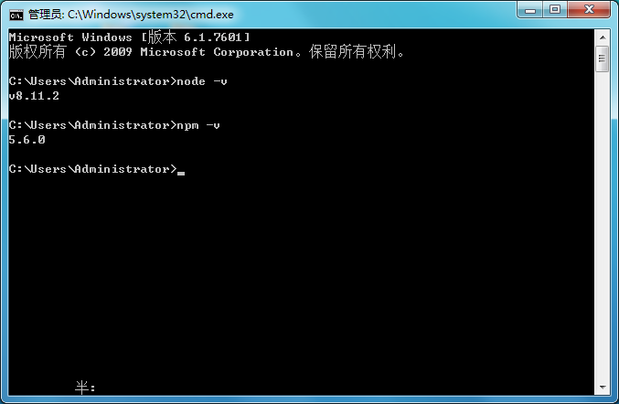

#Gulp install
----------
>流程： **安装nodejs -> 全局安装gulp -> 项目安装gulp以及gulp插件 -> 配置gulpfile.js -> 运行任务**

##install


####打开cmd控制台，直接查看node版本，检测是否安装成功



#### 全局安装 gulp：

* 全局安装gulp目的是为了通过她执行gulp任务；   

```

    $ npm install --global gulp

```
>全局安装gulp，出现warn不要紧，等他慢慢转，表示正在联网下载...   
>查看是否正确安装：命令提示符执行`gulp -v`，出现版本号即为正确安装。   

####package.josn配置

* 创建package.json文件，这是基于nodejs项目必不可少的配置文件，它是存放在项目根目录的普通json文件：

```

    $ npm init -y

```

>直接在后面加上 -y 会自动生成，省去一步步的选择填空操作。   


####项目安装gulp

* 还需要在每个要使用gulp的项目中都单独安装一次

```

    npm install gulp --save-dev

```

>--save-dev 是可以省掉你手动修改package.json文件的步骤，正常情况下得连同版本号手动将他们添加到模块配置文件package.json中的依赖里

####配置gulpflie.js文件

* 在当前项目文件下创建文件名为gulpfile.js文件, 作为该项目配置文件.

```js

    //gulpfile.js

    var gulp = require('gulp');
    gulp.task('default',function(){
        console.log('hello world');
    });

```
>其实在项目文件夹下输入命令`gulp`时, 就是触发这个`default`任务, 因此, 我们定义多个自定义事件, 这样在输入`gulp`时, 就可以直接将我们写的命令也一起触发.   

#### 运行gulp

* 按照上面步骤就可以在当前目录打开cmd运行：


```

    gulp

```


###My Gulp Configuration

>Example

```json

{
  "name": "liujw",
  "version": "1.0.0",
  "description": "",
  "main": "index.js",
  "scripts": {
    "test": "echo \"Error: no test specified\" && exit 1"
  },
  "keywords": [],
  "author": "",
  "license": "ISC",
  "devDependencies": {
    "babel-core": "^6.26.3",
    "babel-preset-es2015": "^6.24.1",
    "browser-sync": "^2.23.2",
    "gulp": "^3.9.1",
    "gulp-autoprefixer": "^4.1.0",
    "gulp-babel": "^7.0.0",
    "gulp-browser-sync": "^0.0.4",
    "gulp-copy": "^1.0.1",
    "gulp-minify-css": "^1.2.4",
    "gulp-plumber": "^1.1.0",
    "gulp-pngmin": "^0.2.1",
    "gulp-sass": "^3.1.0",
    "gulp-tinypng": "^1.0.2",
    "gulp-uglify": "^3.0.0"
  }
}


```


```javascript

var gulp = require("gulp");//定义任务插槽
var gulp_minfy_css = require("gulp-minify-css");//css压缩
var gulp_sass = require("gulp-sass");//sass转换压缩
var gulp_plumber = require("gulp-plumber");//取消报错终止
var gulp_tinypng = require("gulp-tinypng");//图片压缩
var gulp_uglify = require("gulp-uglify");//压缩js
var browser_sync = require("browser-sync").create();//浏览器实时监听
var gulp_autoprefixer = require("gulp-autoprefixer");//自动生成兼容前缀
var gulp_copy = require('gulp-copy');//拷贝
var gulp_babel = require("gulp-babel");

//文件复制
gulp.task('copy', function() {
    gulp.src("./src/fonts/*.*")
    .pipe(gulp_copy('./dist/fonts',{prefix:2}));
    gulp.src("./src/*.html")
    .pipe(gulp_copy('./dist',{prefix:2}));
})

//scss转换css
gulp.task("sass",function(){
	gulp.src('./src/scss/**/*.scss')
	.pipe(gulp_plumber())
	.pipe(gulp_sass())
	.pipe(gulp.dest('./src/css'));
})

//实时监听scss文件变化，转化为css
gulp.task("watchscss",function(){
	gulp.watch("./src/scss/**/*.scss",["sass"])
})

//定义自动刷新浏览器任务
gulp.task('browser-sync', function() {
    browser_sync.init({
    	port:Math.floor(Math.random()*9999)+1000,
    	//产生随机端口号
        server: {
            baseDir: "./src"
        }
    });
    gulp.watch("./src/scss/**/*.scss",["sass"]).on("change",browser_sync.reload)
    gulp.watch("./src/*.html").on("change",browser_sync.reload);
});


//dist压缩部分

//css压缩
gulp.task("mincss",function(){
	//这个任务具体要做的是事情就在这里写
	gulp.src('./src/scss/**/*.scss')
	.pipe(gulp_plumber())
	.pipe(gulp_sass())
	.pipe(gulp_minfy_css({
		keepspecialComments:'*'
		//保留所有特殊前缀，当你用autoprefixer生成的浏览器前缀，如果不加这个参数，有可能将会删除你的部分前缀
	}))
	.pipe(gulp_autoprefixer({
			browsers: ['last 2 versions', 'Android >= 4.0','iOS 7','last 3 Safari versions'],
			cascade: false
		}))
	.pipe(gulp.dest('./dist/css'));
})

//img压缩
gulp.task("minimg",function(){
	gulp.src('./src/images/**/*.*')
	.pipe(gulp_plumber())
	.pipe(gulp_tinypng("dQ5okTCk1kmCe5JwxmYpZaJALFkhX2sX"
))
	.pipe(gulp.dest('./dist/images'));
})

//js压缩
gulp.task("minjs",function(){
	gulp.src('./src/js/**/*.js')
	.pipe(gulp_babel({
		presets:['es2015']
	}))
	.pipe(gulp_uglify())
	.pipe(gulp.dest('dist/js'));
})


//定义一键开发模式
gulp.task("dev",["browser-sync"]);

//定义一键生成模式
gulp.task("pro",["mincss","minjs","minimg","copy"]);

```