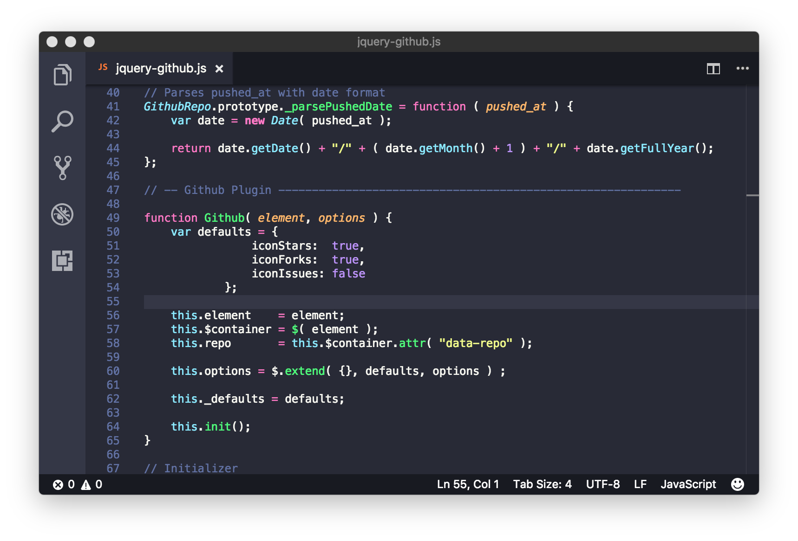

## VS code 插件   

### [Beautify](https://marketplace.visualstudio.com/items?itemName=HookyQR.beautify)   

**格式化代码**   

---

### [Bookmarks](https://marketplace.visualstudio.com/items?itemName=alefragnani.Bookmarks)   

**代码位置记录跳转**   

```
    Ctrl+Alt+K 标记/取消
    Ctrl+Alt+K 上跳
    Ctrl+Alt+K 下跳

```
---   

### [Chinese](https://marketplace.visualstudio.com/items?itemName=MS-CEINTL.vscode-language-pack-zh-hans)   

**适用于 VS Code 的中文（简体）语言包**   

---

### [Dracula Official](https://marketplace.visualstudio.com/items?itemName=dracula-theme.theme-dracula)   

**主题**   

   

---

### [Easy Sass](https://marketplace.visualstudio.com/items?itemName=spook.easysass)   

**scss自动编译**   

```
配置:

"easysass.formats": [
        {
            "format": "compact",  
            // 压缩nested：嵌套缩进的css代码，它是默认值。/expanded：没有缩进的、扩展的css代码。/compact：简洁格式的css代码。/compressed：压缩后的css代码。
            "extension": ".wxss"
            // 输出文件后缀
        }
    ],
"easysass.targetDir": "",
// 自定义css输出文件路径 / 空为当前目录生成

```
---

### [Vetur](https://marketplace.visualstudio.com/items?itemName=octref.vetur)   

**语法加亮/格式化/错误检查...**   

---

### 微信小程序   

**识别wxml/语法提示/api提示...**   

+ [minapp](https://marketplace.visualstudio.com/items?itemName=qiu8310.minapp-vscode)
+ [vscode-wechat](https://marketplace.visualstudio.com/items?itemName=qinjia.vscode-wechat)
+ [小程序助手](https://marketplace.visualstudio.com/items?itemName=debian001.app-migrator)
+ [vscode weapp api](https://marketplace.visualstudio.com/items?itemName=coderfee.vscode-weapp-api)
+ [vscode wxml](https://marketplace.visualstudio.com/items?itemName=coderfee.vscode-wxml)
