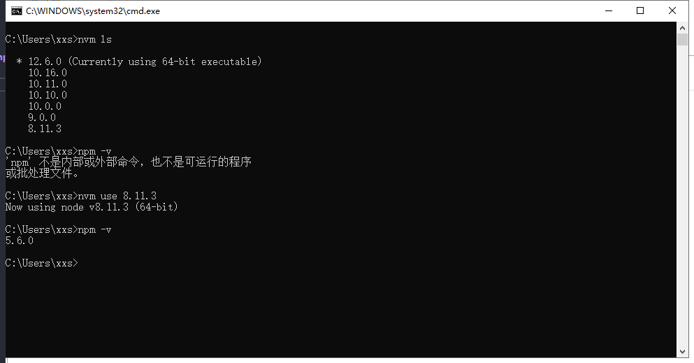
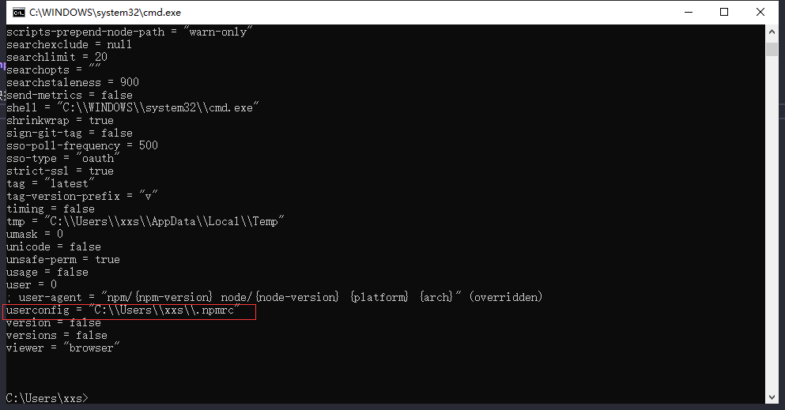
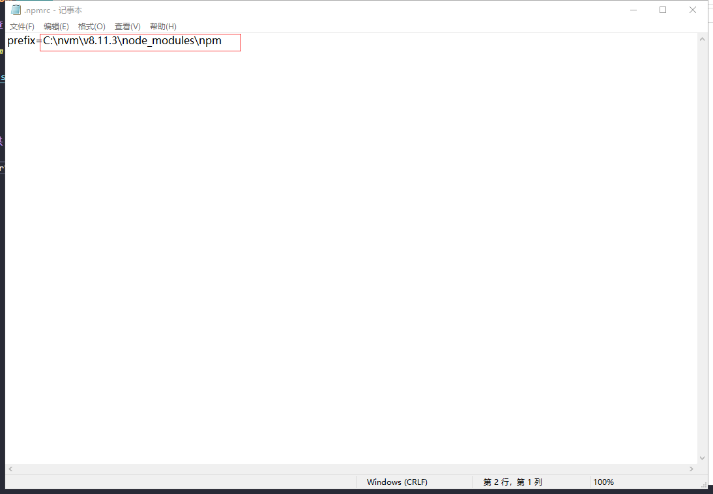
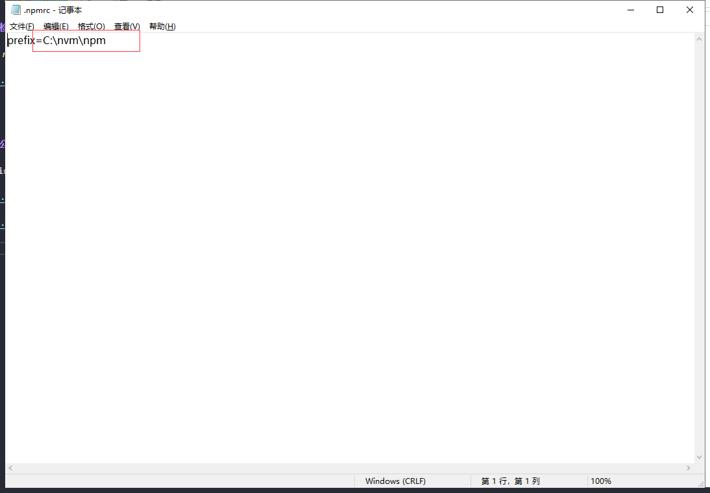
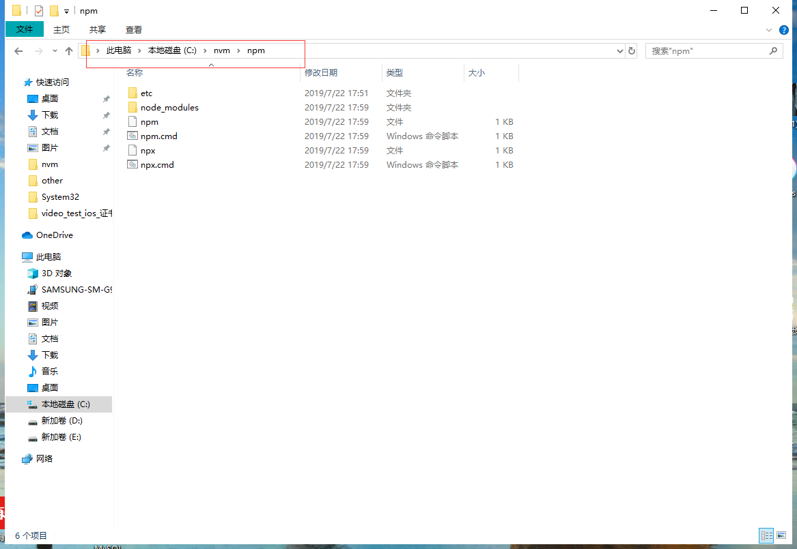
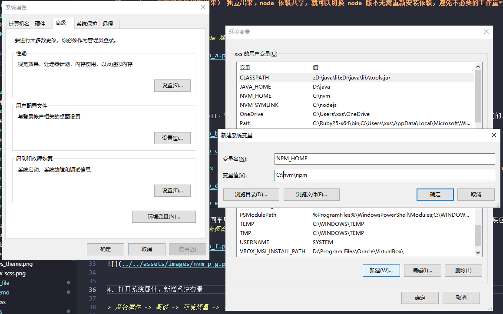
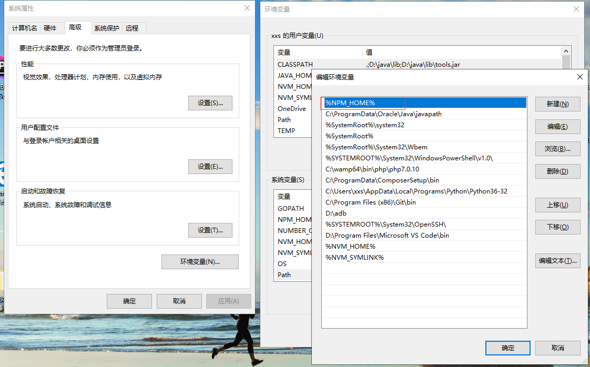

## 独立 npm 目录，多个 node 版本共享依赖 

**[nvm下载,安装node](./nvm_install.md)**   

**将 npm（node包管理工具提取出来） 独立出来，node 依赖共享，就可以切换 node 版本无需重新安装依赖，避免不必要的工作量**   

### 首先检查 npm    

> **若出现 npm 命令不可用，将 node 版本回退到10.10.0版本以下，发现10.10.0版本以上的node版本不包含npm模块。**   

--- 

### 配置公共 npm 模块

#### 1. 通过win+r快捷键打开powershell，输入 `npm config ls -l`，查看npm的配置详细信息，你会看到userconfig这个属性所指向的.npmrc文件，打开可查看npm下载目录 （注：不要直接修改路径）。   

---

#### 2. 输入 `npm config set prefix "C:\nvm\npm"` （带双引号）回车，修改npm下载目录，这时会在nvm目录下生成npm文件夹，同时userconfig这个属性所指向的.npmrc文件里prefix路径发生改变。

---

#### 3. 输入 `npm install npm -g` 回车后会发现正在下载npm包，在C:nvm\npm目录中可以看到下载中的文件，以后我们只要用npm安装包的时候加上 -g 就可以把包安装在我们刚刚配置的全局路径下了 。
> 注意：所有node版本公用该文件夹资源，注意npm包版本兼容

---

#### 4. 打开系统属性，配置环境变量   

##### 1. 新建系统变量   

    > 系统属性 -> 高级 -> 环境变量 -> 新建（系统变量）

---

##### 2. 编辑系统变量(Path)；**添加在 %NVM_SYMLINK%之前**。 （上移到顶部）   

    > 系统属性 -> 高级 -> 环境变量 -> 选中Path（系统变量）-> 编辑 —> 新增 -> 上移 -> 一直确认

---

##### 3. 检查配置是否成功

