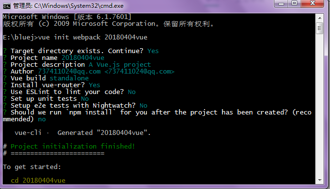

###Vue-cli

####检查 node 和 npm 版本

> 第一次安装 vue-cli 要检查 node 和 npm 的版本，**node 要 4.0 以上，npm 要 3.0 以上**（node 和 npm 的安装就略过了）。   


```js
	node -v
	npm -v
```


####vue-cli安装

* 全局安装vue-cli

```js
	$ npm install --global vue-cli
```
	
	
* 进入计划存放项目的根文件，创建一个基于 webpack 模板的新项目，在这里，我们将这个项目的名称命名为vue-cli-demo

```js
	$ vue init webpack vue-cli-demo(projectname)
```

###vue-cli选项    (图片下方解释)


	
	
	
###命令含义	


| 命令 | 解释 |
| -------- | ----- |
|Target directory exists. Continue? (Y/n)|找到了<projectname>这个目录是否要继续|
| vue init webpack projectname(项目名字) | 安装vue-cli,初始化vue项目的命令 |
| Project name | 项目的名称（默认是文件夹的名称），ps：项目的名称不能有大写，不能有中文，否则会报错 |
| Project description | 项目描述，可以自己写 |
| Author  | 项目创建者,如果你有配置git的作者，他会读取。 |
| Vue build (Use arrow keys)  | -选择打包方式，有两种方式（runtime和standalone），使用默认即可 |
| Install vue-router?  | 是否安装路由，一般都要安装 |
| Use ESLint to lint your code? (Y/n)  | 是否启用eslint检测规则，这里个人建议选no，因为经常会各种代码报错，新手还是不安装好 |
| Setup unit tests with Karma + Mocha? (Y/n)  | 是否安装单元测试 |
| Setup e2e tests with Nightwatch? (Y/n)   | 是否安装e2e测试  |
| Should we run npm install for you after the project has been created? (recommended) npm   | 这一步会询问你使用npm安装还是yarn安装包依赖，我这里选择的是npm |
| cd projectname(项目名字)  | 进入我们的vue项目目录。 |
| npm install  | 安装我们的项目依赖包，也就是安装package.json里的包，如果你网速不好，你也可以使用cnpm来安装。 |
| npm run dev  | 开发模式下运行我们的程序。给我们自动构建了开发用的服务器环境和在浏览器中打开，并实时监视我们的代码更改，即时呈现给我们 |
	

-------------------------------------------------------------------------------

>搞定，附上：[vue开发文档](https://cn.vuejs.org/v2/guide/)
