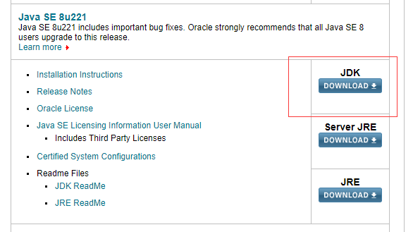
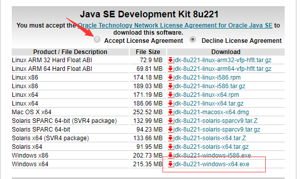
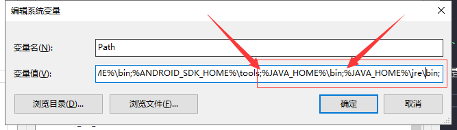
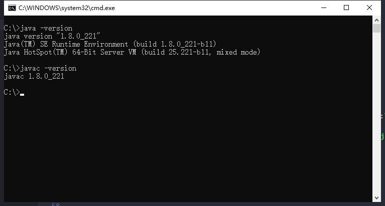

# 下载并安装 JDK (windows)

### 1. 下载安装java SE;   
> link -> [http://www.Oracle.com/technetwork/Java/javase/downloads/index.html](http://www.Oracle.com/technetwork/Java/javase/downloads/index.html)    

**注意：亲测安装最新版本的 java se（目前12.0.2）导致 cordova 运行失败。目前安装 Java SE 8u221 运行正常**

* ps：旧版本需要登陆才允许下载，按照流程注册登陆即可。

    1. 选择jdk版本

       

    2. 根据系统选择对应版本

    

### 2. 环境变量配置

+ 自己选择路径安装完，**注：不可以保存在中文路径下**。   

+ 打开：我的电脑/计算机 —— 属性 —— 高级系统设置 —— 环境变量。   

    1. 新建一个系统环境变量，变量名为 `JAVA_HOME`，变量值为JDK的安装目录路径(ex:`D:\SDK\java\jdk1.8.0_221`)。
    

    2. 在系统变量找到`Path`变量-编辑，新建 `%JAVA_HOME%\bin` 和 `%JAVA_HOME%\jre\bin` 两个。
        
        > ps: 若下面检测环境步骤失败，尝试将这两个值上移到首位（移到首位后可能会由可视化格式状态变为编辑文本状态）    

        * 可视化格式状态下新增。  

        

        * 编辑文本状态下新增（注意：**用`;`进行隔开**）。   

        

### 3. 检测jdk是否安装成功

> 打开cmd命令行分别运行 `java -version`,`javac -version`;

---

> next -> [Android SDK 下载与配置](./androidSdk.md);