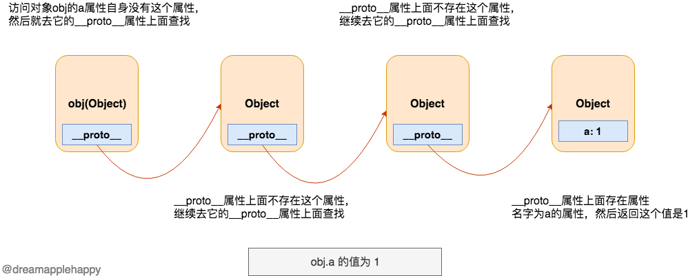
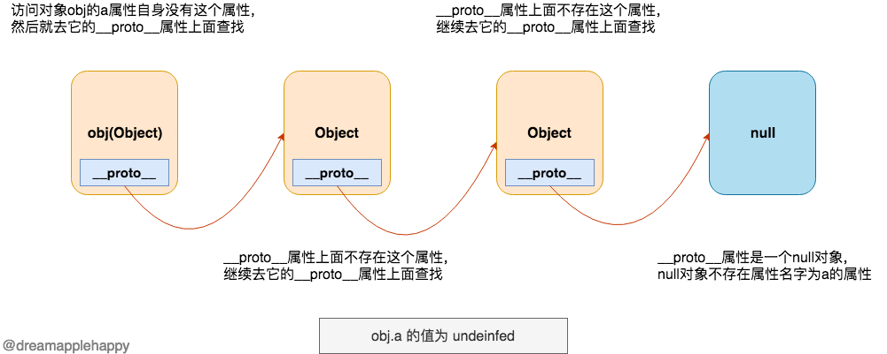

# `__proto__`


### 理解

访问一个对象的某个属性的时候，如果这个对象自身不存在这个属性， 那么就从这个对象的 `__proto__` (为了方便下面描述，这里暂且把这个属性称作 `p0` )属性上面 继续查找这个属性，如果 `p0` 没找到属性而且还有  `__proto__`(`p1`) 属性的话，那么就会继续在 `p1` 上面查找响应的属性， 直到查找到这个属性(返回`value`)，或者没有`__proto__`属性为止(返回`undeinfed`)。   


### 图例



---



---

### 修改示例

``` js

    // 修改一个Number类型的值的原型
    const num = 1;
    num.__proto__.name = "My name is 1";
    console.log(num.name); // My name is 1

    // 修改一个对象的原型
    const obj = {};
    obj.__proto__.name = "dreamapple";
    console.log(obj.name); // dreamapple

```


### 注意

 `__proto__` 这个属性虽然被大多数的浏览器支持，但是其实它仅在 **ECMAScript 2015** 规范中被准确的定义， 目的是为了给这个传统的功能定制一个标准，以确保浏览器之间的兼容性。通过使用 `__proto__` 属性来修改一个对象的原型是非常慢且影响性能的一种操作。 所以，现在如果我们想要获取一个对象的原型，推荐使用 `Object.getPrototypeOf` 或者 `Reflect.getPrototypeOf` ，设置一个对象的原型推荐使用 `Object.setPrototypeOf` 或者是 `Reflect.setPrototypeOf` 。


### 总结   

1. **存在哪里？** 除了`null`和`undefined`所有其他的`JavaScript`对象或者原始类型都有这个属性
1. **代表了什么？** 表示了一个对象的原型
1. **有什么作用？**  可以获取和修改一个对象的原型