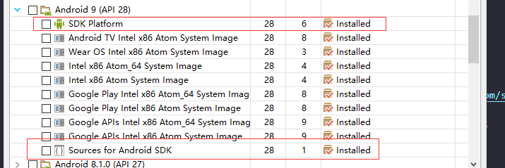

# 下载并安装 Android SDK (windows)

1. 官网[下载地址-https://developer.android.com/studio](https://developer.android.com/studio)  

2. 国内[下载地址-https://www.androiddevtools.cn/](https://www.androiddevtools.cn/)   

> ps: 官网貌似要翻墙 ，以下流程基于上面第二地址

### 1. 找到 SDK Tools 下载对应的系统版本。   

+ 下载完成后解压或安装到对应的目录，**注：尽量不要保存在中文路径下**。   

---

### 2. 在 SDK Tools 目录下找到 SDK Manager 双击打开   
1. Tools 选择前三个就好   
    

2. api 可以选最新，**但是 cordova 运行或打包会提示需要 api 28 所以这里选了Android 9(API 28) SDK项(System Image 可选)**---不知道是电脑版本原因还是cordova原因   

    > 亲测 Android Virtual Device (AVD) 即虚拟机，本电脑只能正常运行 Android 6.0(API 23) ,其它版本要么黑屏要么闪退（---听说不能运行8.0以上的版本，待测）   

    

3. Extras 全选   
    

4. 选择完成后点击 Install Num Packages 进行下载 (**成功安装后status值为Installed；失败/未安装为Not installed**)。   

---

### 3. packages下载可能会存在失败。可以尝试重新勾选下载（基本反复下载几次就好了...）。   

   

**若还是不行，可尝试以下方法**

> ps：本人未尝试过

* 采用有Android SDK在线更新镜像服务器来下载安装：   
    1. 北京化工大学镜像服务器地址:   
        IPv4: `ubuntu.buct.edu.cn/` 端口：`80`;   
        IPv4: `ubuntu.buct.cn/` 端口：`80`;   
        IPv6: `ubuntu.buct6.edu.cn/` 端口：`80`;   
    2. 大连东软信息学院镜像服务器地址:   
        `mirrors.neusoft.edu.cn` 端口：`80`;
    3. 郑州大学开源镜像站:   
        `mirrors.zzu.edu.cn` 端口：`80`;

* 使用方法：   
    1. 启动 Android SDK Manager ，打开主界面，依次选择『Tools』->『Options...』，弹出『Android SDK Manager - Settings』窗口。
    2. 在『Android SDK Manager - Settings』窗口中，在『HTTP Proxy Server』和『HTTP Proxy Port』输入框内填入上面镜像服务器地址(不包含http://，如下图)和端口；
    3. 并且选中『Force https://... sources to be fetched using http://...』复选框。设置完成后单击『Close』按钮关闭『Android SDK Manager - Settings』窗口返回到主界面；
    4. 依次选择『Packages』、『Reload』。

* 参考图：    

       

---

### 4. 配置环境变量（与jdk环境变量配置相仿）

* 打开：我的电脑/计算机 —— 属性 —— 高级系统设置 —— 环境变量。    

    1. 新建一个系统环境变量，变量名为 `ANDROID_SDK_HOME`，变量值为JDK的安装目录路径(ex:`D:\SDK\Android`)。      
    
    2. 在系统变量找到`Path`变量-编辑，新建 `%ANDROID_SDK_HOME%\platform-tools` 和 `%ANDROID_SDK_HOME%\tools` 两个。  
        > ps: 若下面检测环境步骤失败，尝试将这两个值上移到首位（移到首位后可能会由可视化格式状态变为编辑文本状态） 

---

### 5. 检测 android SDK 环境配置   

>打开命令行窗口，输入 `adb` 。出现如下图所示内容则配置成功：   

  

--- 

> next -> [Gradle 下载与配置](./gradle.md);
