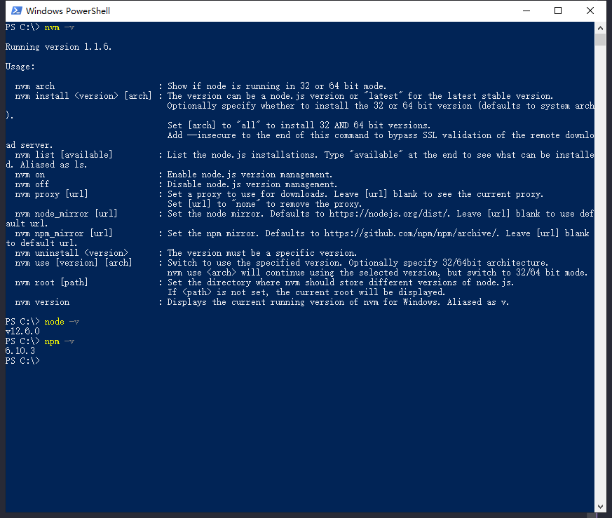
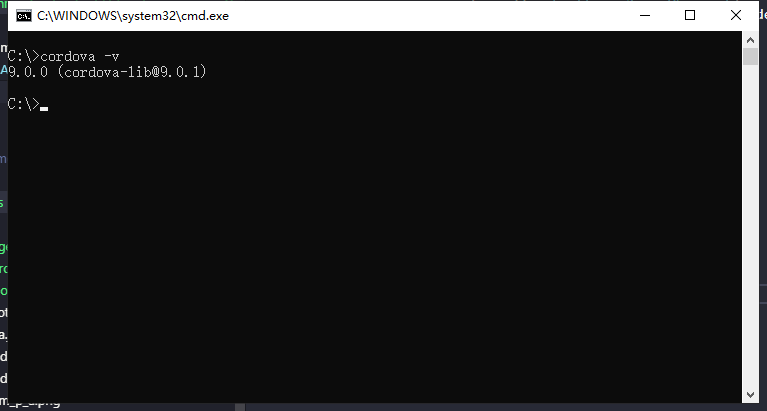

# cordova 环境搭建 (windows)

### 1. 搭建node环境

* 方法一 ： 官网下载[node](https://nodejs.org/zh-cn/)配置环境;
* 方法二 ： 使用[nvm](../node/nvm_install.md)管理下载node配置环境;

##### 检测node环境：

> 打开cmd命令行分别运行 `nvm -v`,`node -v`,`npm -v`;

---

### 2. 安装 cordova cli 

* 打开cmd命令行运行 `npm install -g cordova`;

##### 检测是否安装成功

> 打开cmd命令行运行 `cordova -v`;

---

> next -> [JDK下载与配置](./jdk.md);

