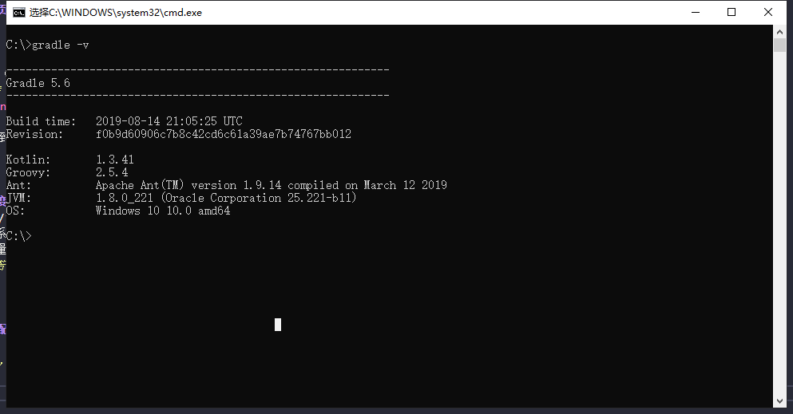

# Gradle 下载与配置 (windows)

### 1. 进入下载页面进行选择版本下载

+ 下载对应压缩包（貌似推荐complete这个）  

    > 下载页链接 [https://gradle.org/releases/](https://gradle.org/releases/);   

      

+ 下载完成后解压到对应的目录，**注：尽量不要保存在中文路径下**。   

---

### 2. 配置环境变量   

* 打开：我的电脑/计算机 —— 属性 —— 高级系统设置 —— 环境变量。    

    1. 新建一个系统环境变量，变量名为 `GRADLE_HOME`，变量值为JDK的安装目录路径(ex:`D:\SDK\Gradle\gradle-5.6`)。   

    2. 在系统变量找到`Path`变量-编辑，新建 `%GRADLE_HOME%\BIN`。   

        > ps: 若下面检测环境步骤失败，尝试将这两个值上移到首位（移到首位后可能会由可视化格式状态变为编辑文本状态） 

---

### 3. 测试是否配置成功   

> 打开命令行窗口，输入 `gradle -v` 。出现如下图所示内容则配置成功： 

  

---

**到这里 ，Apache Cordova 开发环境基本搭建完成，可以对 cordova 项目进行开发调试**

> [cordova + vue-cli](./vueCli.md) 配置，开发单页混合应用    

> [Apache Cordova](https://cordova.apache.org/);