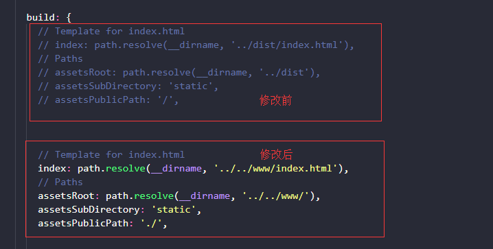

# cordova + vue-cli 开发单页混合应用

**请确保你当前已经配置好cordova开发环境和vue开发环境**

### 1. cmd 命令行运行安装 `vue-cli` &&  查看 `vue` 是否安装成功

```

    $ npm install -g @vue/cli

    $ vue --version

```

---

### 2. 创建 && 运行 cordova项目

1. 到指定目录下创建   

    ```
        $ cordova create projectName
    ```

2. 切入项目目录   

    ```
        $ cd projectName
    ```

3. 添加平台(android)    

    ```
        $ cordova platform add android --save
    ```

4. 检查你当前平台设置状况:   

    ```
        $ cordova platform ls
    ```

5. 检测你是否满足构建平台的要求:   

    ```
        $ cordova requirements

        // 下面为结果示例
        Requirements check results for android:
        Java JDK: installed .
        Android SDK: installed
        Android target: installed android-19,android-21,android-22,android-23,Google Inc.:Google APIs:19,Google Inc.:Google APIs (x86 System Image):19,Google Inc.:Google APIs:23
        Gradle: installed

        Requirements check results for ios:
        Apple OS X: not installed
        Cordova tooling for iOS requires Apple OS X
        Error: Some of requirements check failed
    ```

6. 运行调试(先保证cordova项目没问题，再进行增加vue-cli)   

    ```
        $ cordova run android
    ```

---

### 3. 在 projectName 项目下添加 vue项目；

1. 利用 `vue-cli` 快速构建项目

```
   $ vue init webpack appName
```

2. 切换到 appName 项目运行指令，检测vue项目是否搭建成功

```
    $ cd .\app\

    $ npm i     

    $ npm run dev

    // 浏览器打开 http://localhost:8080 （默认）

```

---

### 4. 整合 cordova 与 vue-cli ;

1. 打开vue项目下的config/index.js文件，修改打包目标目录

      

2. 修改 vue 项目下的index.html文件，添加script

    ```js

        <script src="cordova.js"></script>

    ```

3. 将vue打包 && 运行cordova到模拟器

    > ps : 只需在vue项目目录下执行即可，无需切换目录

    ```
        $ npm run build

        $ cordova run android
    ```

    + **运行成功！**   

         

4. 自定义脚本命令   

    > 更改vue下的package.json ， 添加自定义命令，如下：

    ```

        "scripts": {
            ...
            "android": "npm run build && cordova run android"
        }

    ```

    * 这样就不用二次输入，可以执行 `npm run android` ，实现打包完 vue 后再运行到 android；

----

**只要不涉及到 cordova 插件或者 cordova api，就可以开启 `npm run dev` 在浏览器里面进行开发调试**   

> [vue.js](https://cn.vuejs.org/index.html);     


> [Apache Cordova](https://cordova.apache.org/);

