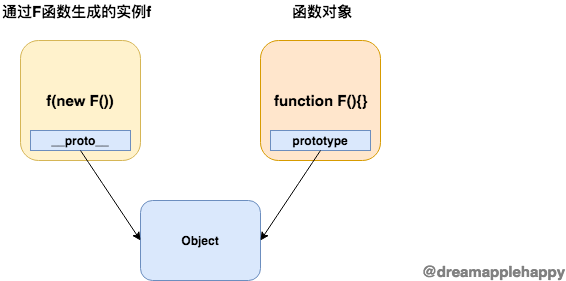

# prototype

### 理解   

这个属性一般只存在于**函数对象**上面； 只要是能够作为**构造器的函数**，他们都包含这个属性。也就是说，只要这个**函数**能够通过使用 `new` 操作符来生成一个**新的对象**， 那么这个函数肯定具有 `prototype` 属性。因为我们自定义的函数都可以通过 `new` 操作符生成一个对象，所以我们**自定义的函数**都有 `prototype` 这个属性。

``` js

    // 函数字面量
    console.log((function(){}).prototype); // {constructor: ƒ}

    // Date构造器
    console.log(Date.prototype); // {constructor: ƒ, toString: ƒ, toDateString: ƒ, toTimeString: ƒ, toISOString: ƒ, …}

    // Math.abs 不是构造器，不能通过new操作符生成一个新的对象，所以不含有prototype属性
    console.log(Math.abs.prototype); // undefined

```

### 作用   

函数通过使用 `new` 操作符生成的一个对象， 这个对象的原型(也就是 `__proto__` )指向该函数的 `prototype` 属性。 那么一个比较简洁的表示 `__proto__` 和 `prototype` 属性之间关系的等式也就出来了，如下所示：

``` js 

    // 其中F表示一个自定义的函数或者是含有prototype属性的内置函数
    new F().__proto__ === F.prototype // true

```

### 关系



---

### 总结

1. **存在哪里？** 自定义的函数，或者能够通过new操作符生成一个对象的内置函数   
2. **代表了什么？**  它表示了某个函数通过new操作符生成的对象的原型    
3. **有什么作用？** 可以让一个函数通过new操作符生成的许多对象共享一些方法和属性   