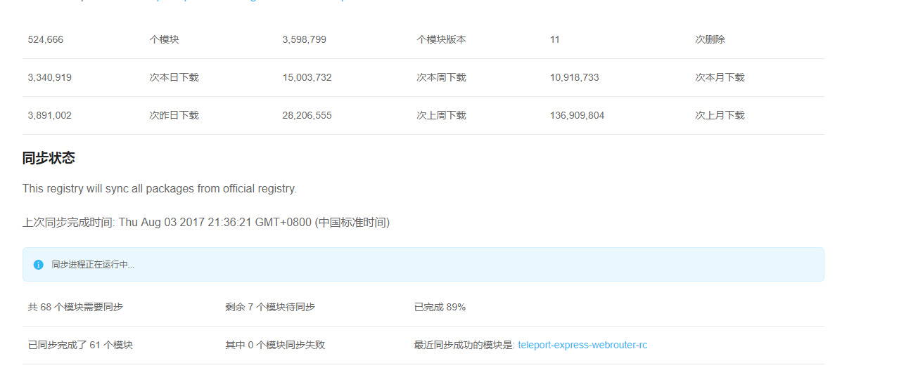

###cnpm - 淘宝镜像

####cnpm 相关：

1. 这是一个完整 npmjs.org 镜像，是用来同步npm上面的模块。   
2. cnpm的同步频率为 10分钟 （新发布的模块有滞后性，同步是需要时间的，等不及的可以使用npm）。   
3. 安装cnpm的原因：npm的服务器是外国的，所以有时候我们安装“模块”会很很慢很慢超级慢。   
4. cnpm的作用：淘宝镜像将npm上面的模块同步到国内服务器，提高我们安装模块的时间。   
5. 安装完淘宝镜像之后，cnpm和npm命令行皆可使用，二者并不冲突

	


* 安装方法:打开命令行工具，输入命令行：   

	```js
		$ npm install -g cnpm --registry=https://registry.npm.taobao.org
	```

* cnpm使用方法:

	```js
		$ cnpm install [name]
	```
	
>安装模块的时候，将npm换成cnpm就行，国内很多coder都是使用cnpm的，个人建议大家都装一下。[淘宝镜像地址](http://npm.taobao.org/)。
