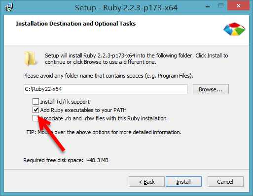

###window-scss install

####1.ruby安装
>sass依赖于ruby环境，所以装sass之前先确认装了ruby。先导官网下载个[ruby](https://rubyinstaller.org/downloads/) 在安装的时候，请勾选Add Ruby executables to your PATH这个选项，添加环境变量，不然以后使用编译软件的时候会提示找不到ruby环境   




>安装完成后需测试安装有没有成功,运行CMD输入以下命令：

```
    ruby -v
    //如安装成功会打印
    ruby 2.2.2p95 (2015-04-13 revision 50295) [i386-mingw32]
```

* 附上：<a href="../assets/app/ruby.rar" download target="_blank">rubyinstaller-2.5.1-1-x64</a> 


####2.sass安装
>安装完ruby之后，在开始菜单中，找到刚才我们安装的ruby，打开Start Command Prompt with Ruby


>命令行输入

```
    gem install sass
```

>按回车键确认，等待一段时间就会提示你sass安装成功。如果你没有安装成功，可以尝试下面方法，或参考下面的淘宝的RubyGems镜像安装sass，如果成功则忽略。

```
    //1.删除原gem源
    gem source --remove https://rubygems.org

    //2.添加国内淘宝源
    gem source --add http://rubygems.org

    //3.打印是否替换成功
    gem sources -l

    //4.更换成功后打印如下
    *** CURRENT SOURCES ***
    https://ruby.taobao.org/
```

>如果要安装beta版本的，可以在命令行中输入

```
    gem install sass --pre
```

>你还可以从sass的Git repository来安装，git的命令行为

```
    git clone git://github.com/nex3/sass.git
    cd sass
    rake install
```
>如下sass常用更新、查看版本、sass命令帮助等命令：

```
    //更新sass
    gem update sass

    //查看sass版本
    sass -v

    //查看sass帮助
    sass -h
```

####3.淘宝RubyGems镜像安装 sass(安装失败请继续看)

* 由于国内网络原因，导致 `rubygems.org` 存放在 `Amazon S3` 上面的资源文件间歇性连接失败。这时候我们可以通过`gem sources`命令来配置源，先移除默认的`https://rubygems.org`源，然后添加淘宝的源`https://ruby.taobao.org/`，然后查看下当前使用的源是哪个   

>关于常用gem source命令可参看：常用的`gem source`

```
    $ gem sources --remove https://rubygems.org/
    $ gem sources -a https://ruby.taobao.org/
    $ gem sources -l
    *** CURRENT SOURCES ***

    https://ruby.taobao.org

    # 请确保只有 ruby.taobao.org,如果是淘宝的，则表示可以输入sass安装命令了。
    $ gem install sass
```

>安装成功截图：


>附上：[官方安装](https://www.sass.hk/install/)